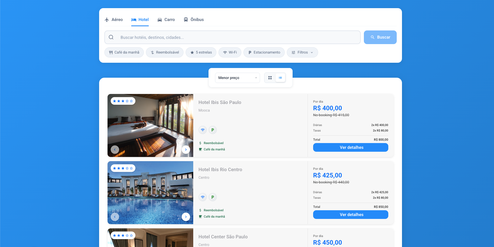
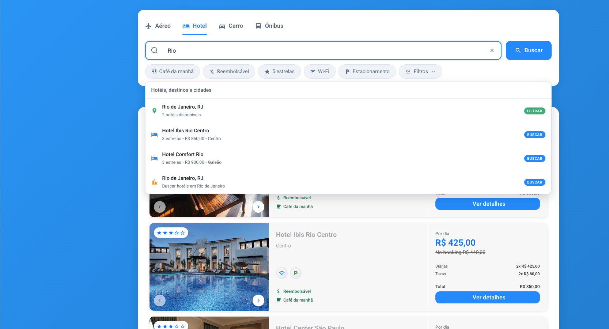
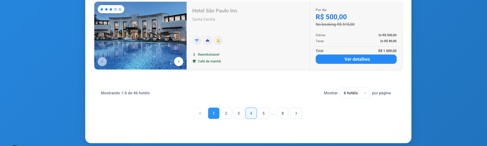

# 🏨 Onfly - Sistema de Busca de Hotéis


Sistema completo de busca e filtros de hotéis desenvolvido com Nuxt 3, Pinia e JSON Server - Com finalidade de teste de conhecimento.
Por Matheus Esturiao.

## 📸 Screenshots


*Interface principal do sistema de busca*


*Painel de filtros avançados*


*Paginaçao com paginas para desktop e paginação infinita para mobile.


## 🚀 Funcionalidades

- **Busca de hotéis** com filtros avançados
- **Filtros por**: preço, estrelas, comodidades, localização, café da manhã, quarto reembolsável
- **Ordenação** por preço, classificação e nome
- **API REST** completa com JSON Server
- **Store Pinia** bem estruturada e DRY
- **Interface responsiva** e moderna
- **Estatísticas em tempo real**

## 🛠️ Tecnologias

- **Frontend**: Nuxt 3, Vue 3, TypeScript
- **Estado**: Pinia
- **Estilização**: SCSS
- **API**: JSON Server
- **Ícones**: Material Icons

## 📦 Instalação

```bash
# Clone o repositório
git clone <repository-url>
cd Onfly

# Instale as dependências
npm install

# Inicie o servidor JSON e o projeto
npm run start
```

## 🎯 Scripts Disponíveis

```bash
# Desenvolvimento completo (servidor + frontend)
npm run start
npm run dev:full

# Apenas o servidor JSON
npm run server

# Apenas o frontend
npm run dev

# Build para produção
npm run build
```

## 🌐 Endpoints da API

### Base URL: `http://localhost:3001/api`

| Método | Endpoint | Descrição |
|--------|----------|-----------|
| GET | `/hotels` | Lista todos os hotéis |
| GET | `/hotels/search` | Busca com filtros |
| GET | `/hotels/stats` | Estatísticas gerais |
| GET | `/hotels/filtered` | Hotéis filtrados com stats |
| GET | `/places` | Lista todos os lugares |
| GET | `/amenities` | Lista todas as comodidades |
| GET | `/health` | Health check |

### Exemplo de uso da API

```bash
# Buscar hotéis com filtros
GET /api/hotels/filtered?minPrice=100000&maxPrice=300000&stars=4,5&amenities=WI_FI,POOL

# Buscar estatísticas
GET /api/hotels/stats

# Buscar hotéis por texto
GET /api/hotels/search?q=São Paulo
```

## 🏗️ Estrutura do Projeto


```
Onfly/
├── components/          # Componentes Vue
│   ├── HotelCard.vue   # Card de hotel
│   ├── HotelFilters.vue # Filtros
│   └── HotelHeader.vue  # Cabeçalho com busca
├── data/               # Dados e servidor
│   ├── hotels.json     # Dados dos hotéis
│   └── server.js       # Servidor JSON
├── stores/             # Stores Pinia
│   └── hotels.ts       # Store principal
├── types/              # Tipos TypeScript
│   └── index.ts        # Interfaces
└── pages/              # Páginas
    └── index.vue       # Página principal
```

## 📊 Dados Disponíveis

### Hotéis (20 hotéis)
- **São Paulo**: 10 hotéis
- **Rio de Janeiro**: 4 hotéis
- **Belo Horizonte**: 2 hotéis
- **Salvador**: 2 hotéis
- **Curitiba**: 2 hotéis

### Filtros Disponíveis
- **Preço**: R$ 90 - R$ 500.000
- **Estrelas**: 3, 4, 5 estrelas
- **Comodidades**: Wi-Fi, Estacionamento, Piscina, Restaurante, Academia, etc.
- **Características**: Café da manhã, Quarto reembolsável
- **Localização**: 5 cidades brasileiras

## 🔧 Configuração

### Variáveis de Ambiente
```env
# Porta do servidor JSON (padrão: 3001)
PORT=3001

# URL da API (padrão: http://localhost:3001/api)
API_BASE_URL=http://localhost:3001/api
```

### Personalização
- **Cores**: Edite `assets/styles/variables.scss`
- **Dados**: Modifique `data/hotels.json`
- **API**: Configure rotas em `data/server.js`

## 🎨 Design System

### Cores
- **Primary**: #009EFB (Azul)
- **Success**: #00835C (Verde)
- **Info**: #ADADB3 (Cinza)

### Espaçamentos
- Base: 4px
- Disponíveis: 4px, 8px, 12px, 16px, 20px, 24px, 32px, etc.

### Breakpoints
- **SM**: 576px
- **MD**: 768px
- **LG**: 992px
- **XL**: 1200px

## 🚀 Deploy

### Build para Produção
```bash
npm run build
npm run generate
```

### Servidor de Produção
```bash
npm run preview
```

## 📝 Licença

Este projeto está sob a licença MIT.

## 🤝 Contribuição

1. Fork o projeto
2. Crie uma branch para sua feature (`git checkout -b feature/AmazingFeature`)
3. Commit suas mudanças (`git commit -m 'Add some AmazingFeature'`)
4. Push para a branch (`git push origin feature/AmazingFeature`)
5. Abra um Pull Request

## 📞 Suporte

Para dúvidas ou suporte, abra uma issue no repositório.

## 📸 Como Adicionar Imagens

### Imagens Locais
Para adicionar imagens da pasta `assets/doc/`:

```markdown

```

### Imagens com Link
Para adicionar imagens com link clicável:

```markdown
[](https://link-para-imagem.com)
```

### Imagens Centralizadas
Para centralizar imagens:

```markdown
<p align="center">
  
</p>
```

### Formatos Suportados
- PNG, JPG, JPEG
- GIF (animado)
- SVG
- WebP
